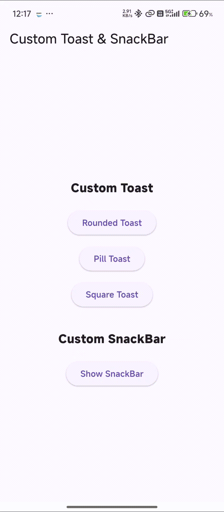

# Flutter Custom Toast & SnackBar


A reusable Flutter package that provides **custom Toast messages and SnackBars** with support for icons, text, background colors, shapes, sizes, padding, margins, and display duration.

It helps developers create consistent notification messages without repeatedly building custom Toast and SnackBar components in every Flutter application.

## Preview


<p align="center">
  
</p>

## Features


* Custom Toast messages
* Custom SnackBars
* Icon support
* Custom icon color
* Custom text color
* Custom background color
* Custom font size
* Custom icon size
* Rounded shape
* Pill shape
* Square shape
* Custom border radius
* Custom Toast duration
* Custom SnackBar duration
* Custom Toast padding
* Custom SnackBar padding
* Custom SnackBar margin
* Easy to integrate
* Lightweight implementation

## Why This Package?


Developers frequently need notification messages for:

* Successful operations
* Error messages
* Information messages
* Warnings
* Profile updates
* Form submissions
* API responses
* Application events

Instead of creating the same Toast and SnackBar UI repeatedly, this package provides reusable components with customizable appearance and behavior.

### Without the package


```dart
ScaffoldMessenger.of(context).showSnackBar(
  const SnackBar(
    content: Text('Profile updated successfully!'),
  ),
);
```


### With this package


```dart
CustomSnackBar.show(
  context,
  message: 'Profile updated successfully!',
  icon: Icons.check_circle,
  backgroundColor: Colors.green,
);
```

The package provides a reusable and customizable SnackBar without manually configuring the complete UI each time.

## Installation


Add the package to your `pubspec.yaml`:

```yaml
dependencies:
  flutter_custom_toast_snackbar:
    path: ../
```


For a published package, use the package version instead:

```yaml
dependencies:
  flutter_custom_toast_snackbar: ^1.0.0
```


Then run:

```bash
flutter pub get
```


## Import


```dart
import 'package:flutter_custom_toast_snackbar/flutter_custom_toast_snackbar.dart';
```


## Custom Toast


Display a simple Toast message:

```dart
CustomToast.show(
  context,
  message: 'Saved successfully!',
);
```


### Toast with Icon


```dart
CustomToast.show(
  context,
  message: 'Saved successfully!',
  icon: Icons.check_circle,
  backgroundColor: Colors.green,
);
```


### Toast Shapes


The package supports three Toast shapes:

```text
ToastShape.rounded
ToastShape.pill
ToastShape.square
```


#### Rounded Toast

```dart
CustomToast.show(
  context,
  message: 'Rounded Toast',
  icon: Icons.check,
  backgroundColor: Colors.green,
  shape: ToastShape.rounded,
);
```


#### Pill Toast

```dart
CustomToast.show(
  context,
  message: 'Pill Toast',
  icon: Icons.info,
  backgroundColor: Colors.blue,
  shape: ToastShape.pill,
);
```


#### Square Toast

```dart
CustomToast.show(
  context,
  message: 'Square Toast',
  icon: Icons.error,
  backgroundColor: Colors.red,
  shape: ToastShape.square,
);
```


## Toast Customization


Customize the Toast appearance:

```dart
CustomToast.show(
  context,
  message: 'Profile updated!',
  icon: Icons.person,
  backgroundColor: Colors.deepPurple,
  textColor: Colors.white,
  iconColor: Colors.white,
  shape: ToastShape.rounded,
  borderRadius: 16,
  iconSize: 24,
  fontSize: 16,
  duration: const Duration(seconds: 3),
  padding: const EdgeInsets.symmetric(
    horizontal: 20,
    vertical: 14,
  ),
);
```


## Custom SnackBar


Display a simple SnackBar:

```dart
CustomSnackBar.show(
  context,
  message: 'Changes saved successfully!',
);
```

### SnackBar with Icon


```dart
CustomSnackBar.show(
  context,
  message: 'Profile updated!',
  icon: Icons.person,
  backgroundColor: Colors.blue,
);
```


### SnackBar Shapes


The package supports three SnackBar shapes:

```text
SnackBarShape.rounded
SnackBarShape.pill
SnackBarShape.square
```


#### Rounded SnackBar

```dart
CustomSnackBar.show(
  context,
  message: 'Rounded SnackBar',
  icon: Icons.check,
  backgroundColor: Colors.green,
  shape: SnackBarShape.rounded,
);
```


#### Pill SnackBar

```dart
CustomSnackBar.show(
  context,
  message: 'Pill SnackBar',
  icon: Icons.notifications,
  backgroundColor: Colors.deepPurple,
  shape: SnackBarShape.pill,
);
```


#### Square SnackBar

```dart
CustomSnackBar.show(
  context,
  message: 'Square SnackBar',
  icon: Icons.error,
  backgroundColor: Colors.red,
  shape: SnackBarShape.square,
);
```


## SnackBar Customization


Customize the SnackBar appearance:

```dart
CustomSnackBar.show(
  context,
  message: 'Changes saved successfully!',
  icon: Icons.check_circle,
  backgroundColor: Colors.green,
  textColor: Colors.white,
  iconColor: Colors.white,
  shape: SnackBarShape.rounded,
  borderRadius: 16,
  iconSize: 24,
  fontSize: 16,
  duration: const Duration(seconds: 4),
  padding: const EdgeInsets.symmetric(
    horizontal: 20,
    vertical: 14,
  ),
  margin: const EdgeInsets.all(16),
);
```


## Toast Parameters


The `CustomToast.show()` method supports:

```text
message
icon
backgroundColor
textColor
iconColor
shape
borderRadius
iconSize
fontSize
duration
padding
```


## SnackBar Parameters


The `CustomSnackBar.show()` method supports:

```text
message
icon
backgroundColor
textColor
iconColor
shape
borderRadius
iconSize
fontSize
duration
padding
margin
```

**svg**

## Complete Example


```dart
import 'package:flutter/material.dart';
import 'package:flutter_custom_toast_snackbar/flutter_custom_toast_snackbar.dart';

class ExamplePage extends StatelessWidget {
  const ExamplePage({super.key});

  void showToast(BuildContext context) {
    CustomToast.show(
      context,
      message: 'Saved successfully!',
      icon: Icons.check_circle,
      backgroundColor: Colors.green,
      shape: ToastShape.rounded,
    );
  }

  void showSnackBar(BuildContext context) {
    CustomSnackBar.show(
      context,
      message: 'Profile updated!',
      icon: Icons.person,
      backgroundColor: Colors.blue,
      shape: SnackBarShape.pill,
    );
  }

  @override
  Widget build(BuildContext context) {
    return Scaffold(
      body: Center(
        child: Column(
          mainAxisAlignment: MainAxisAlignment.center,
          children: [
            ElevatedButton(
              onPressed: () {
                showToast(context);
              },
              child: const Text('Show Toast'),
            ),
            const SizedBox(height: 16),
            ElevatedButton(
              onPressed: () {
                showSnackBar(context);
              },
              child: const Text('Show SnackBar'),
            ),
          ],
        ),
      ),
    );
  }
}
```


## Architecture


The package follows a simple structure separating the public package entry point from the Toast and SnackBar implementations.

```text
flutter_custom_toast_snackbar/
│
├── example/
│   ├── assets/
│   │   └── demo.gif
│   │
│   └── lib/
│       └── main.dart
│
├── lib/
│   ├── flutter_custom_toast_snackbar.dart
│   │
│   └── src/
│       ├── custom_toast.dart
│       └── custom_snackbar.dart
│
├── test/
├── CHANGELOG.md
├── LICENSE
├── README.md
└── pubspec.yaml
```


### Architecture Flow


```text
Application
     ↓
Flutter Custom Toast & SnackBar
     ↓
     ├── CustomToast
     │      ↓
     │   ToastShape
     │
     └── CustomSnackBar
            ↓
        SnackBarShape
```


## Example


The package contains an example application demonstrating:

* Custom Toast
* Custom SnackBar
* Icons
* Custom colors
* Custom text
* Rounded shape
* Pill shape
* Square shape
* Custom sizes
* Custom duration
* Custom padding
* Custom SnackBar margin

Run the example:

```bash
cd example
flutter pub get
flutter run
```


## Development


Install dependencies:

```bash
flutter pub get
```

**svg**

Run static analysis:

```bash
flutter analyze
```

**svg**

Run tests:

```bash
flutter test
```

**svg**

Run the example application:

```bash
cd example
flutter pub get
flutter run
```


## License


Copyright (c) 2026 Excelsior Technologies

Permission is hereby granted, free of charge, to any person obtaining a copy of this software and associated documentation files (the "Software"), to deal in the Software without restriction, including without limitation the rights to use, copy, modify, merge, publish, distribute, sublicense, and/or sell copies of the Software, and to permit persons to whom the Software is furnished to do so, subject to the following conditions:

The above copyright notice and this permission notice shall be included in all copies or substantial portions of the Software.

THE SOFTWARE IS PROVIDED "AS IS", WITHOUT WARRANTY OF ANY KIND, EXPRESS OR IMPLIED, INCLUDING BUT NOT LIMITED TO THE WARRANTIES OF MERCHANTABILITY, FITNESS FOR A PARTICULAR PURPOSE AND NONINFRINGEMENT. IN NO EVENT SHALL THE AUTHORS OR COPYRIGHT HOLDERS BE LIABLE FOR ANY CLAIM, DAMAGES OR OTHER LIABILITY, WHETHER IN AN ACTION OF CONTRACT, TORT OR OTHERWISE, ARISING FROM, OUT OF OR IN CONNECTION WITH THE SOFTWARE OR THE USE OR OTHER DEALINGS IN THE SOFTWARE.
